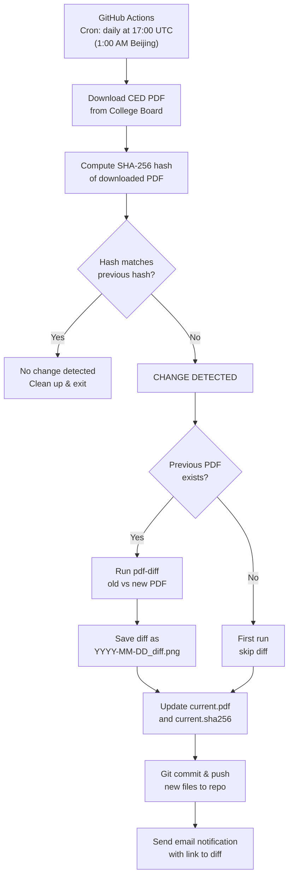

# CED Monitor — Architecture Document

**Purpose:** Architecture spec for a GitHub Actions-based system that monitors the College Board AP Cybersecurity CED PDF for changes daily, generates visual diffs, and sends email notifications. Designed to be fed directly to VS Code Copilot for code generation.

---

## 1. Project Overview

- **Goal:** Detect any changes to the College Board AP Cybersecurity Course and Exam Description (CED) PDF, automatically generate a visual diff showing what changed, and notify via email.
- **Deployment:** GitHub Actions (scheduled workflow on a public repo — free, unlimited minutes)
- **Language:** Python 3.12
- **Repo name:** `ced-monitor`
- **Target PDF URL:** `https://apcentral.collegeboard.org/media/pdf/ap-cybersecurity-course-and-exam-description.pdf`

---

## 2. Architecture Diagram



---

## 3. File Structure

```
ced-monitor/
├── .github/
│   └── workflows/
│       └── check-ced.yml           # GitHub Actions workflow definition
├── check.py                        # Main Python script
├── requirements.txt                 # Python dependencies (pdf-diff)
├── data/
│   ├── current.pdf                  # Latest downloaded CED PDF (git-tracked)
│   └── current.sha256               # SHA-256 hash of current PDF (git-tracked)
├── diffs/
│   └── <YYYY-MM-DD>_diff.png        # Visual diff images (accumulate over time)
└── README.md                        # Repo description
```

---

## 4. Component Specifications

### 4.1 — `check.py` (Main Script)

**Responsibility:** Download PDF, detect changes, generate visual diff, signal results to GitHub Actions.

**Constants:**

- `CED_URL` — the full College Board PDF URL
- `DATA_DIR` — `Path("data")`
- `DIFF_DIR` — `Path("diffs")`
- `CURRENT_PDF` — `data/current.pdf`
- `HASH_FILE` — `data/current.sha256`

**Functions:**

| Function | Input | Output | Description |
| --- | --- | --- | --- |
| `sha256(filepath)` | `Path` | `str` (hex digest) | Reads file in 8KB chunks, returns SHA-256 hex string |
| `download_pdf()` | none | `Path` (temp file) | Downloads CED PDF to `data/new.pdf` using `urllib.request.urlretrieve` |
| `generate_diff(old_pdf, new_pdf)` | `Path, Path` | `Path or None` | Runs `pdf-diff` CLI as subprocess, captures stdout (PNG bytes), writes to `diffs/YYYY-MM-DD_diff.png`. Returns path to diff image or `None` on failure. |
| `main()` | none | none | Orchestration function (see flow below) |

**`main()` flow:**

1. Create `data/` and `diffs/` directories if they don't exist
2. Call `download_pdf()` → get `new_pdf` path
3. Call `sha256(new_pdf)` → get `new_hash`
4. Read `current.sha256` → get `old_hash` (or `None` if file doesn't exist)
5. If `new_hash == old_hash`: print "No change", delete temp file, `sys.exit(0)`
6. If `current.pdf` exists: call `generate_diff(current.pdf, new_pdf)`
7. Replace `current.pdf` with `new_pdf` (rename/move)
8. Write `new_hash` to `current.sha256`
9. Write `changed=true` to `$GITHUB_OUTPUT` (so the workflow knows a change occurred)
10. If diff image was generated, also write `diff_image=<path>` to `$GITHUB_OUTPUT`

**Error handling:**

- If PDF download fails (network error, 404): print error, exit with non-zero code. GitHub Actions will mark the run as failed.
- If `pdf-diff` fails or produces no output: log warning, continue without diff image. The hash change and commit still happen.
- If `pdf-diff` binary not found: log warning, skip diff generation.

**Dependencies (stdlib only + pdf-diff):**

- `hashlib`, `os`, `subprocess`, `sys`, `pathlib`, `urllib.request`, `datetime`
- External: `pdf-diff` (installed via pip)

### 4.2 — `pdf-diff` Tool

**What it is:** Python CLI tool (`pip install pdf-diff`) by JoshData.

**How it works:**

1. Extracts the text layer from both PDFs using `pdftotext` (from `poppler-utils`)
2. Compares text positions between the two PDFs
3. Rasterizes changed pages to PNG
4. Draws **red outlines** around changed/added/removed text
5. Outputs the PNG image to stdout

**CLI usage:**

```
pdf-diff before.pdf after.pdf > output.png
```

**System dependency:** Requires `poppler-utils` (for `pdftotext`). Must be installed via `apt-get install poppler-utils` in the GitHub Actions workflow.

**Why this over pymupdf4llm or text diff:** The CED has complex formatting (tables, columns, headers, sidebars). Text extraction tools would lose structure. `pdf-diff` operates at the visual/positional level — it compares where text appears on the page, not reconstructed document structure. More reliable for heavily formatted PDFs.

### 4.3 — GitHub Actions Workflow (`check-ced.yml`)

**Trigger:**

- `schedule`: cron `0 17 * * *` (daily at 17:00 UTC = 1:00 AM Beijing time)
- `workflow_dispatch`: manual trigger button in GitHub UI (for testing)

**Runner:** `ubuntu-latest`

**Steps:**

| Step | Action | Details |
| --- | --- | --- |
| 1. Checkout | `actions/checkout@v4` | Clones the repo so we have `data/`, `diffs/`, `check.py` |
| 2. Setup Python | `actions/setup-python@v5` | Python 3.12 |
| 3. Install deps | `run` | `apt-get install poppler-utils`  • `pip install -r requirements.txt` |
| 4. Run script | `run: python check.py` | Set `id: check` so we can read its outputs |
| 5. Commit & push | `run` | Configure git user as "CED Monitor Bot", `git add data/ diffs/`, commit if staged changes exist, push. Use `git diff --staged --quiet \ |
| 6. Send email | `dawidd6/action-send-mail@v3` | Only runs `if: steps.check.outputs.changed == 'true'`. Uses Gmail SMTP (see secrets below). |

**Required GitHub Secrets** (repo Settings → Secrets → Actions):

- `EMAIL_USERNAME` — Gmail address (e.g., `barryshen777@gmail.com`)
- `EMAIL_PASSWORD` — Gmail App Password (16-char, generated from Google Account → Security → App Passwords)

**Email content:**

- **To:** `barryshen777@gmail.com`
- **Subject:** `🚨 AP Cybersecurity CED has changed!`
- **Body:** Notification text + link to `diffs/` folder in the repo + link to commit history
- **From name:** `CED Monitor`

**Git commit configuration:**

- User name: `CED Monitor Bot`
- User email: `bot@ced-monitor.github.io`
- Commit message format: `CED updated: YYYY-MM-DD`

---

## 5. Data Flow

<aside>
🔁

**Daily cycle (no change):**

Actions triggers → downloads PDF → computes hash → matches stored hash → exits → no commit → no email

</aside>

<aside>
🚨

**Daily cycle (change detected):**

Actions triggers → downloads PDF → computes hash → hash differs → runs `pdf-diff` on old vs new → saves diff PNG → updates `current.pdf` + `current.sha256` → git commit + push → email sent with link to diff

</aside>

<aside>
🆕

**First run:**

Actions triggers → downloads PDF → computes hash → no previous hash exists → skips diff (no old PDF to compare) → saves `current.pdf` + `current.sha256` → git commit + push → email sent (first baseline captured)

</aside>

---

## 6. Dependencies

| Dependency | Type | Purpose |
| --- | --- | --- |
| `pdf-diff` | pip package | Visual PDF comparison, outputs PNG with red outlines |
| `poppler-utils` | apt package | Provides `pdftotext` binary, required by `pdf-diff` |
| `actions/checkout@v4` | GitHub Action | Clones the repo in the workflow |
| `actions/setup-python@v5` | GitHub Action | Installs Python on the runner |
| `dawidd6/action-send-mail@v3` | GitHub Action | Sends email via SMTP |

---

## 7. Setup Instructions

1. Create public repo `ced-monitor` on GitHub
2. Clone locally in VS Code
3. Generate the 3 files from this architecture doc using Copilot
4. Run `python check.py` locally once to capture the initial PDF baseline
5. Commit and push everything (including `data/current.pdf` and `data/current.sha256`)
6. Set up GitHub Secrets for email (optional — can be added later):
    - Go to repo → Settings → Secrets and variables → Actions → New repository secret
    - Add `EMAIL_USERNAME` = your Gmail address
    - Add `EMAIL_PASSWORD` = Gmail App Password (Google Account → Security → 2-Step Verification → App Passwords → generate for "Mail")
7. Test: Go to repo → Actions tab → "Check CED for Changes" → "Run workflow"

---

## 8. Edge Cases & Notes

- **College Board changes the URL:** The script will fail to download (404 or redirect). The GitHub Actions run will show as failed. Update `CED_URL` in `check.py`.
- **College Board serves the same content but with different metadata:** SHA-256 will detect this as a change (hash includes all bytes). `pdf-diff` may show no visual differences. This is fine — better to over-report than miss a real change.
- **Large diff images:** The CED is ~200 pages. If many pages change, the diff PNG could be large. Git will handle it, but the `diffs/` folder may grow over time. Consider periodic cleanup or `.gitattributes` with Git LFS if it becomes an issue.
- **GitHub Actions cron timing:** Scheduled workflows may be delayed up to 15-60 minutes during high-load periods. This is fine for daily monitoring.
- **Rate limiting by College Board:** Downloading once per day is very conservative. No risk of being rate-limited or blocked.
- **If email step fails:** The commit + push still happens. You'll still see the change in the repo. Email is a nice-to-have notification layer, not critical path.